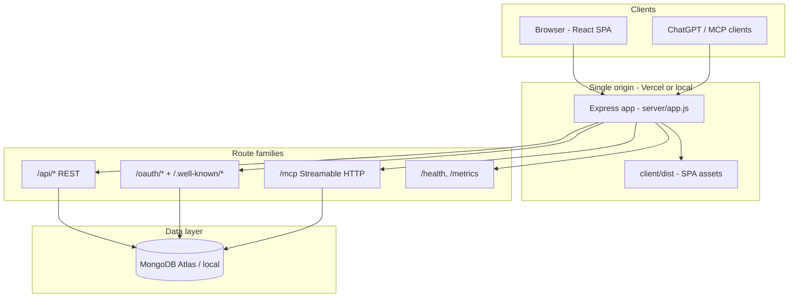
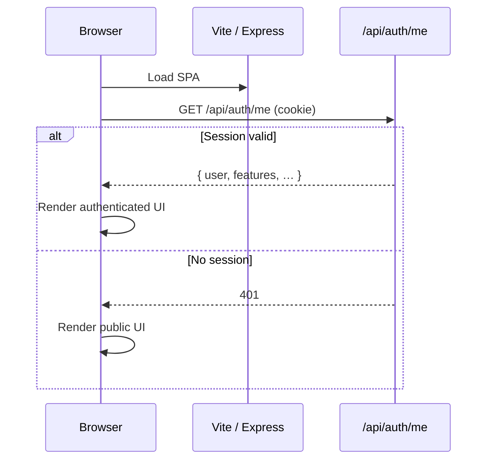
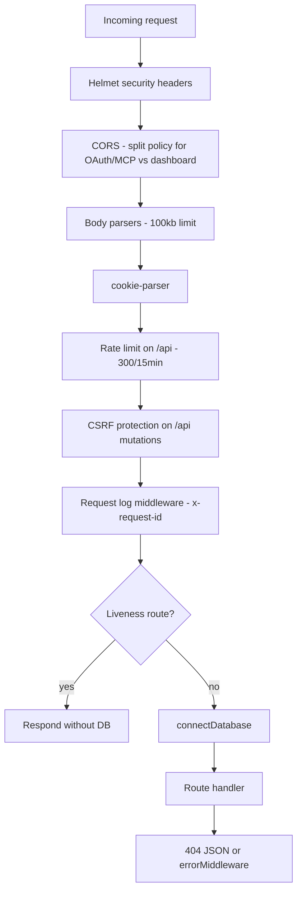
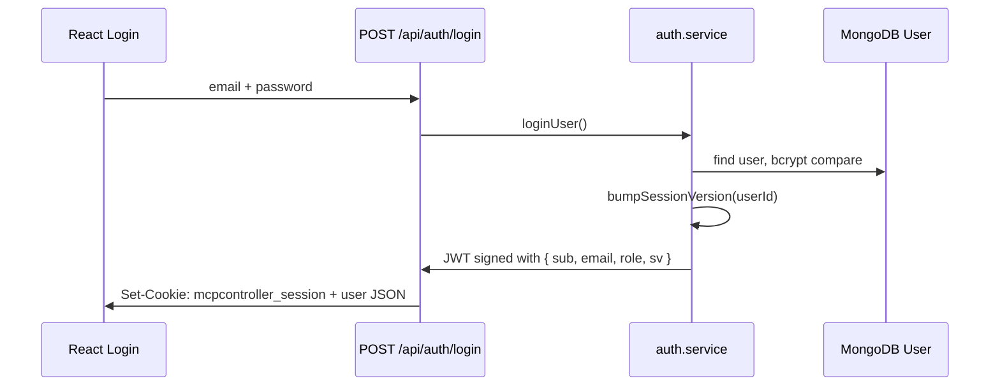
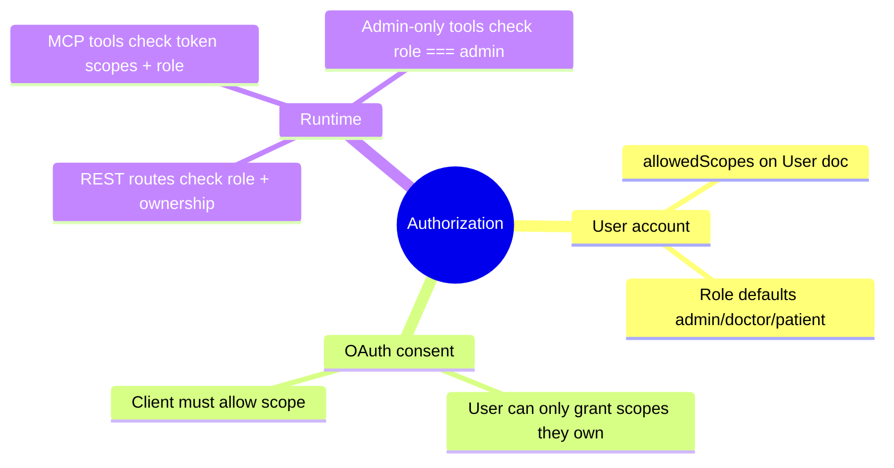
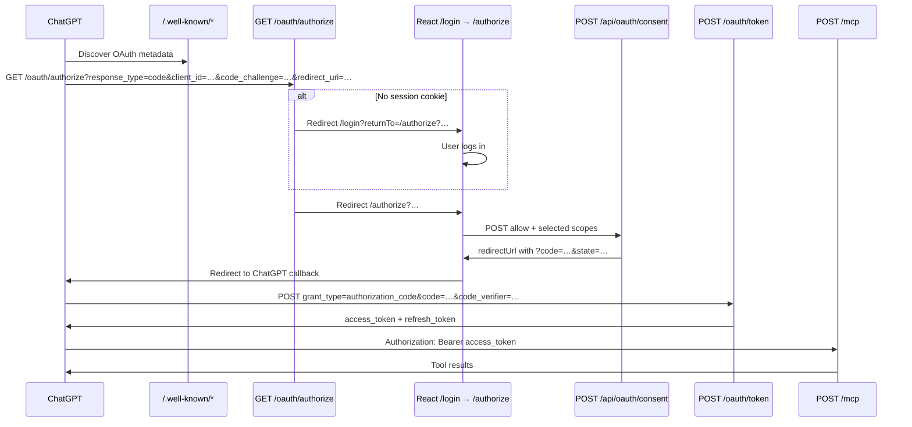
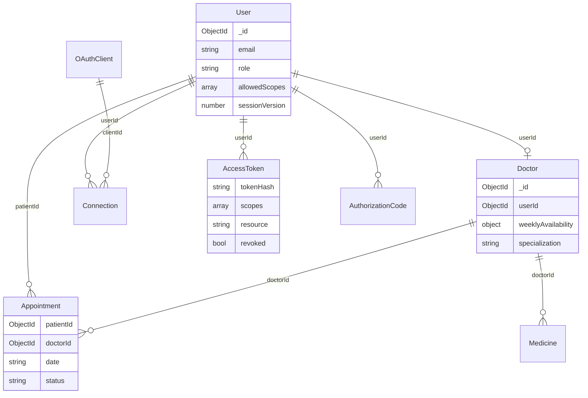
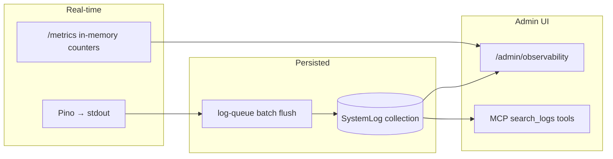
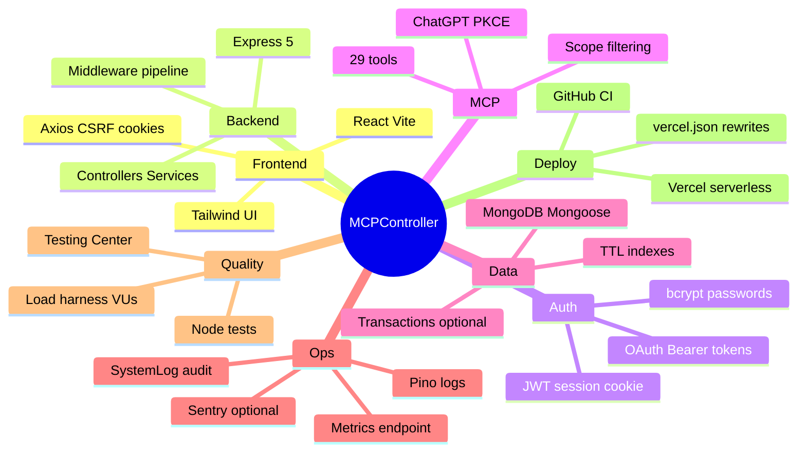

# MCPController — Complete Architecture Guide

This document explains **your actual project** as it exists in the source code today (September 2026). It is written for someone who wants to understand the full system from a browser or ChatGPT request all the way to MongoDB and back.

---

## Table of contents

1. [What this project is](#1-what-this-project-is)
2. [Technology choices](#2-technology-choices)
3. [High-level architecture](#3-high-level-architecture)
4. [Project structure](#4-project-structure)
5. [Deployment architecture](#5-deployment-architecture)
6. [Frontend (React)](#6-frontend-react)
7. [Backend (Express) request pipeline](#7-backend-express-request-pipeline)
8. [Authentication — website sessions](#8-authentication--website-sessions)
9. [Authorization — roles, scopes, and ownership](#9-authorization--roles-scopes-and-ownership)
10. [OAuth 2.1 and PKCE](#10-oauth-21-and-pkce)
11. [MCP server and ChatGPT integration](#11-mcp-server-and-chatgpt-integration)
12. [Database and models](#12-database-and-models)
13. [Core business flows](#13-core-business-flows)
14. [Feature flags](#14-feature-flags)
15. [Security mechanisms](#15-security-mechanisms)
16. [Logging, metrics, and traces](#16-logging-metrics-and-traces)
17. [Testing and load testing](#17-testing-and-load-testing)
18. [Performance, scalability, and reliability](#18-performance-scalability-and-reliability)
19. [Implemented vs recommended](#19-implemented-vs-recommended)
20. [Quick reference diagrams](#20-quick-reference-diagrams)

---

## 1. What this project is

**MCPController** is a single-deploy, full-stack doctor–patient appointment application with three major capabilities baked into one origin:

| Capability | Purpose |
| --- | --- |
| **Web app** | Doctors, patients, and admins manage profiles, availability, appointments, medicines, and OAuth connections through a React UI. |
| **OAuth 2.1 authorization server** | External clients (especially ChatGPT) can authenticate users and receive scoped access tokens. |
| **MCP server** | ChatGPT calls 29 role- and scope-aware tools over Streamable HTTP at `/mcp`. |

Everything runs from **one URL** in production (for example `https://mcpcontroller.vercel.app`). The React SPA, REST API, OAuth endpoints, MCP endpoint, and discovery metadata all share that origin.

### User roles

| Role | How they get in | What they do |
| --- | --- | --- |
| **Admin** | `ADMIN_EMAIL` / `ADMIN_PASSWORD` from environment variables | Full system control: users, permissions, stats, feature flags, observability, Testing Center |
| **Doctor** | Self-registration on the website | Manage own profile/availability, accept/reject appointment requests |
| **Patient** | Self-registration on the website | Browse doctors, book appointments, accept alternative dates |

---

## 2. Technology choices

| Layer | Technology | Why it was chosen |
| --- | --- | --- |
| **Monorepo** | npm workspaces (`client` + `server`) | One repo, one install, shared scripts |
| **Frontend** | React 19, Vite 7, React Router 7, Tailwind CSS 4, Axios | Fast dev server, modern React, utility-first styling |
| **Backend** | Express 5, Node.js 20+ (ESM) | Mature HTTP layer; same app serves API + static files + MCP |
| **Database** | MongoDB via Mongoose 8 | Flexible document model for users, tokens, appointments, logs |
| **Auth (web)** | JWT in HTTP-only cookie (`mcpcontroller_session`) | Browser sessions without exposing tokens to JavaScript |
| **Auth (MCP)** | OAuth 2.1 Bearer tokens (hashed in DB) | Standard for ChatGPT and MCP clients |
| **MCP** | `@modelcontextprotocol/server` + `@modelcontextprotocol/node` | Official MCP SDK; Streamable HTTP with `responseMode: 'json'` for serverless |
| **Validation** | Zod v4 (MCP tool schemas) | Runtime input validation for tool arguments |
| **Logging** | Pino + structured JSON | Production-friendly logs with correlation IDs |
| **Error tracking** | Sentry (optional via `SENTRY_DSN`) | Captures 5xx errors in production/staging |
| **Deployment** | Vercel serverless (`api/index.js`) | Single deploy; rewrites route API/OAuth/MCP to one function |
| **CI** | GitHub Actions | MongoDB service + `npm test` + `npm run build` |

---

## 3. High-level architecture



### Two separate credential systems

This is critical: the website and MCP do **not** share the same credential type.

```text
Website user  →  Cookie: mcpcontroller_session (JWT)  →  /api/* routes
ChatGPT user  →  Header: Authorization: Bearer …     →  /mcp tool calls
```

Both ultimately map to the same `User` document in MongoDB, but they are validated through different middleware paths.

---

## 4. Project structure

```text
MCPController/
├── api/index.js                 # Vercel serverless entry (imports server/app.js)
├── client/                      # React frontend
│   ├── src/pages/               # Login, Dashboard, Authorize, TestingCenter, …
│   ├── src/services/api.js      # Axios client with CSRF + cookies
│   └── vite.config.js           # Dev proxy to Express :3000
├── server/
│   ├── app.js                   # Express app (middleware, routes, static, SPA fallback)
│   ├── index.js                 # Local dev server entry
│   ├── config/                  # env.js, database.js
│   ├── controllers/             # Thin HTTP handlers
│   ├── services/                # Business logic
│   ├── models/                  # Mongoose schemas
│   ├── routes/                  # Express routers
│   ├── middleware/              # auth, CSRF, errors, request logging
│   ├── mcp/                     # MCP server factory + tools
│   └── lib/                     # Shared utilities (logging, metrics, CSRF, pagination, …)
├── load-tests/                  # Node.js load harness + CLI
├── tests/                       # Node test runner integration tests
├── vercel.json                  # Rewrites + serverless config
└── package.json                 # Root scripts (dev, test, load:*)
```

### Layer responsibilities

| Layer | Files | Responsibility |
| --- | --- | --- |
| **Routes** | `server/routes/*.routes.js` | Wire HTTP paths to controllers; apply rate limits |
| **Controllers** | `server/controllers/*.controller.js` | Parse request, call service, send response |
| **Services** | `server/services/*.service.js` | Business rules, DB access, authorization checks |
| **Models** | `server/models/*.js` | Schema, indexes, TTL, validation hooks |
| **MCP tools** | `server/mcp/tools/*.tool.js` | Wrap services for MCP; check scopes via `authInfo` |

---

## 5. Deployment architecture

### Local development

```text
npm run dev
  ├── Express on :3000  (server/index.js)
  └── Vite on :5173     (client/)

Vite proxies /api, /oauth/*, /mcp, /.well-known → localhost:3000
Browser talks to :5173; API calls hit Express through the proxy.
```

Environment: copy `.env.example` → `.env`. `APP_URL=http://localhost:5173`, `API_URL=http://localhost:3000`.

### Production (Vercel)

```text
Git push → Vercel build (npm run build → client/dist)
         → api/index.js handles dynamic routes
         → vercel.json rewrites:
              /api/*, /oauth/*, /mcp, /.well-known/* → /api (serverless function)
              everything else → /index.html (SPA)
```

**Important:** In production, `APP_URL` and `API_URL` must both be the same public origin (for example `https://mcpcontroller.vercel.app`). OAuth metadata, redirects, and MCP resource URLs all derive from these values.

The serverless function has `maxDuration: 60` seconds because MCP tool calls can be slow.

### Environment profiles

| File | Purpose |
| --- | --- |
| `.env` | Base local settings |
| `.env.development` | Optional dev overrides |
| `.env.staging` | Staging validation (weak secrets blocked unless `STAGING_ALLOW_WEAK_SECRETS=true`) |
| `.env.production` | Production rules: strong secrets, `METRICS_TOKEN` required, `TEST_CENTER_ENABLED` must be false |

`server/config/env.js` loads `.env` then `.env.${NODE_ENV}` and validates deployed environments.

### Health and readiness

| Endpoint | Purpose |
| --- | --- |
| `GET /api/health/live` | Liveness — process is up (no DB required) |
| `GET /api/health/ready` | Readiness — MongoDB ping succeeds |
| `GET /api/metrics` | Prometheus-style runtime metrics (token-protected in prod/staging) |

---

## 6. Frontend (React)

### Boot flow



`App.jsx` calls `/api/auth/me` on mount. Protected routes use `ProtectedRoute`; admin pages use `AdminRoute`.

### API client (`client/src/services/api.js`)

- Base URL: `/api` (same origin in prod; proxied in dev)
- `withCredentials: true` — sends session cookie
- CSRF: reads `mcpcontroller_csrf` cookie, sends `X-CSRF-Token` header on POST/PUT/PATCH/DELETE
- **Never** contains secrets (`JWT_SECRET`, `MONGODB_URI`, etc.)

### Key pages

| Route | Page | Who |
| --- | --- | --- |
| `/login`, `/register` | Auth | Public |
| `/dashboard` | Role-specific dashboard | Authenticated |
| `/doctors`, `/doctors/:id` | Browse/book | Authenticated |
| `/medicines` | Medicine & health tips | Authenticated (feature-flag gated) |
| `/authorize` | OAuth consent screen | Authenticated (ChatGPT flow) |
| `/admin/testing` | Testing Center | Admin only |
| `/admin/observability` | Logs, metrics, traces UI | Admin only |

### OAuth consent UI flow

When ChatGPT redirects a logged-in user to `/authorize?client_id=…&code_challenge=…`:

1. React reads query params from the URL.
2. Calls `GET /api/oauth/request` (session cookie) to preview client name and offered scopes.
3. User selects scopes and clicks Allow or Deny.
4. Calls `POST /api/oauth/consent` with `{ decision, scopes, query }`.
5. Backend returns `redirectUrl` with authorization code → browser redirects back to ChatGPT.

---

## 7. Backend (Express) request pipeline

Every HTTP request passes through middleware in `server/app.js` in this order:



### CORS split policy

- **OAuth/MCP/discovery endpoints:** Allow any origin, no credentials (ChatGPT, curl, server-to-server).
- **Dashboard `/api/*`:** Only allowed origins (`APP_URL`, `API_URL`, localhost:5173) with credentials.

This design lets ChatGPT call `/oauth/token` and `/mcp` cross-origin while keeping cookie sessions scoped to your frontend origin.

---

## 8. Authentication — website sessions

### Login flow



### Session details

| Aspect | Implementation |
| --- | --- |
| Cookie name | `mcpcontroller_session` |
| Token type | JWT signed with `JWT_SECRET` |
| Payload | `{ sub, email, role, sv }` where `sv` = session version |
| Flags | `httpOnly`, `sameSite: lax`, `secure` in production |
| TTL | `JWT_EXPIRES_IN` (default 7 days) |
| Invalidation | `sessionVersion` on User document; login/logout/permission change bumps it |

`requireUser` middleware verifies the cookie JWT, loads the user, and checks `payload.sv === user.sessionVersion`. Stale tokens are rejected without revealing why (401).

### Admin login special case

If email matches `ADMIN_EMAIL`, `ensureAdminUser()` upserts the admin from env credentials before password check. Admin password lives only in environment variables, never in seed data alone.

---

## 9. Authorization — roles, scopes, and ownership

Authorization is enforced at **three layers**:



### Roles (`server/lib/roles.js`)

- `admin` — full access
- `doctor` — own doctor record, own appointments, patient read
- `patient` — book appointments, own profile

Legacy `user` role is migrated to `patient` on login.

### Scopes (OAuth + MCP)

Defined in `server/config/env.js`:

```text
doctor:read/create/update/delete
patient:read/create/update/delete
appointment:read/create/update/delete
availability:read/update
profile:read/update
```

Plus legacy `doctor:write` (expands to create + update) for older ChatGPT clients.

### Default scopes by role

| Role | Default scopes |
| --- | --- |
| Admin | All scopes |
| Doctor | read/update doctors, patients, appointments, availability, profile |
| Patient | read doctors/availability/appointments, create/update appointments, profile |

Admins can override a user's `allowedScopes` via `PATCH /api/admin/users/:id/permissions`. That action also **revokes all OAuth tokens** and deletes connections so MCP access reflects the new ceiling immediately.

### MCP tool exposure

`server/mcp/server.js` builds a **fresh McpServer per request** (required for Vercel serverless). Tools are registered only if `isToolExposed(toolName, grantedScopes, role)` returns true.

**Admin-only tools** (role check, not a separate scope):

- `admin_update_appointment`, `admin_get_dashboard_stats`
- `search_logs`, `get_request_logs`

> **Note:** Older docs mention a `logs:read` scope. The current code does **not** define or grant that scope. Log MCP tools require **admin role** only (`tests/observability.test.js` confirms this).

---

## 10. OAuth 2.1 and PKCE

### Discovery endpoints

| URL | Returns |
| --- | --- |
| `/.well-known/oauth-authorization-server` | Issuer, authorize/token/register/revoke URLs, supported scopes, PKCE S256 |
| `/.well-known/oauth-protected-resource` | MCP resource URL, authorization servers, scopes |

### Full ChatGPT connection flow



### PKCE (Proof Key for Code Exchange)

Why PKCE is required: public clients like ChatGPT cannot safely store a client secret. PKCE binds the authorization code to a secret only the client knows.

| Step | What happens |
| --- | --- |
| 1. ChatGPT generates random `code_verifier` | 43–128 character string |
| 2. Sends `code_challenge = BASE64URL(SHA256(code_verifier))` | Method must be S256 |
| 3. User approves → server stores code + challenge | Single-use, TTL default 600s |
| 4. Token exchange sends `code_verifier` | Server recomputes challenge and compares |

Reuse or expiry of authorization codes is logged (`oauth.authorization_code.reused`, etc.).

### Client registration

Two paths:

1. **Dynamic Client Registration (DCR)** — `POST /oauth/register` when `OAUTH_DCR_ENABLED=true` (default in dev, **disabled in production**).
2. **CIMD (Client ID Metadata Document)** — ChatGPT uses an HTTPS URL as `client_id`. Server fetches the JSON document, validates redirect URIs, upserts `OAuthClient`.

Redirect URIs must match **exactly** (normalized URL comparison). Production allows HTTPS only; dev allows localhost HTTP.

### Tokens

| Property | Detail |
| --- | --- |
| Storage | SHA-256 hash only (`AccessToken.tokenHash`) |
| Access TTL | `ACCESS_TOKEN_TTL_SECONDS` (default 3600) |
| Refresh TTL | `REFRESH_TOKEN_TTL_SECONDS` (default 30 days) |
| Resource binding | RFC 8707 — token tied to `{API_URL}/mcp` |
| Refresh rotation | Old grant revoked when refresh used; reuse detection revokes all client tokens |
| Revocation | Dashboard, `POST /oauth/revoke`, or admin permission change |

### Connections dashboard

`Connection` documents track `(userId, clientId)` with granted scopes. Users revoke from the dashboard → tokens marked revoked + connection deleted.

---

## 11. MCP server and ChatGPT integration

### Transport

- **Endpoint:** `POST/GET/DELETE /mcp`
- **Library:** `@modelcontextprotocol/server` with `createMcpHandler`
- **Mode:** `responseMode: 'json'` — avoids long-lived SSE connections (works on Vercel serverless)
- **Auth middleware:** `requireMcpBearer` → sets `req.auth` for the MCP handler

### Per-request server factory

```text
HTTP /mcp request
  → rate limit (120/15min)
  → requireMcpBearer (hash token, load user, filter live scopes)
  → createMcpHandler(({ authInfo }) => buildMcpServer(authInfo))
  → register only allowed tools
  → execute tool → JSON result
```

### Tool execution wrapper

Each tool is wrapped to:

1. Log `mcp.tool.started` / `mcp.tool.completed` / `mcp.tool.failed`
2. Write audit log via `logAudit()`
3. Return `{ content: [{ type: 'text', text: JSON… }] }` or `{ isError: true }`

### Complete tool list (29 tools)

| Category | Tools |
| --- | --- |
| Doctors | `list_doctors`, `get_doctor`, `add_doctor`, `update_doctor`, `delete_doctor` |
| Availability | `check_doctor_availability`, `update_availability` |
| Patients | `list_patients`, `get_patient`, `add_patient`, `update_patient`, `delete_patient` |
| Appointments | `list_appointments`, `get_appointment`, `list_my_appointments`, `list_doctor_appointment_requests`, `request_appointment`, `accept_appointment`, `reject_appointment`, `suggest_alternative_date`, `accept_alternative_date`, `cancel_appointment`, `complete_appointment` |
| Admin | `admin_update_appointment`, `admin_get_dashboard_stats` |
| Profile | `get_my_profile`, `update_my_profile` |
| Logs (admin only) | `search_logs`, `get_request_logs` |

ChatGPT only **lists** tools matching the token's scopes (plus admin tools for admins). If you see few tools, reconnect and grant more scopes on the consent screen.

### WWW-Authenticate challenge

Unauthenticated MCP requests receive:

```http
WWW-Authenticate: Bearer realm="MCPController", resource_metadata="…", scope="…"
```

The `scope` parameter lists all advertised scopes so ChatGPT knows what to request on the consent screen.

---

## 12. Database and models

MongoDB is the single source of truth. Connection pooling and cache are in `server/config/database.js` (global promise cache for serverless warm starts).

### Core models



| Model | Purpose | Notable indexes / TTL |
| --- | --- | --- |
| **User** | Accounts, roles, scopes, session version | Unique email; role + createdAt |
| **Doctor** | Profile linked to User; weekly availability | Partial unique `userId` |
| **Appointment** | Booking lifecycle | **Unique partial**: one ACCEPTED appointment per doctor per day |
| **Medicine** | Health tips per doctor | doctorId + category |
| **OAuthClient** | Registered MCP/OAuth clients | clientId |
| **AuthorizationCode** | Single-use OAuth codes | Hashed code; expiry |
| **AccessToken** | Hashed bearer + refresh tokens | TTL on `grantExpiresAt` |
| **Connection** | Active OAuth grants per user | Unique (userId, clientId) |
| **FeatureFlag** | Feature rollout config | key |
| **SystemLog** | Persisted audit/error logs | **30-day TTL** |
| **RateLimitCounter** | Distributed rate limit hits | Per-key window |
| **BackgroundJob** | Testing Center run state | TTL on expiresAt |

---

## 13. Core business flows

### Appointment booking rules

Enforced in `server/services/appointment.service.js`:

| Rule | Behavior |
| --- | --- |
| One patient per doctor per day | Partial unique index on `(doctorId, date)` where status = ACCEPTED |
| Weekly availability | Doctor must mark weekday as `available` |
| No past dates | Requests must be today or future (UTC date string) |
| No self-booking | Patient cannot book their own doctor account |
| Accept flow | Doctor accepting one REQUESTED appointment rejects other same-day requests (may suggest alternatives) |
| Statuses | REQUESTED → ACCEPTED / REJECTED / ALTERNATIVE_OFFERED → COMPLETED / CANCELLED |

### Typical patient booking (REST)

```text
Patient logs in → GET /api/doctors → GET /api/doctors/:id
→ POST /api/appointments { doctorId, date }
→ Doctor sees REQUESTED → PATCH accept/reject/suggest
→ Patient may accept alternative date
```

The same logic is available through MCP tools with scope checks.

### Medicines feature

Doctors create medicine/health-tip entries. Access is controlled by the **`medicine_health_tips`** feature flag (see next section), not by OAuth scopes.

---

## 14. Feature flags

Currently one flag: **`medicine_health_tips`** (`server/lib/medicines.js`).

### Configuration (admin via `/api/admin/feature-flags/:key`)

| Field | Meaning |
| --- | --- |
| `enabled` | Master switch |
| `doctorAccess` | `all`, `specific` (by doctor ID list), or `percentage` |
| `percentage` | 0–100; stable bucket per doctor via SHA-256 hash (`rollout.js`) |
| `patientsEnabled` | Whether patients can view medicines |

### Access resolution

```text
featuresForUser(user) → included in GET /api/auth/me
assertCanViewMedicines / assertCanManageMedicines → REST + UI gates
```

Flag config is cached in memory (`FEATURE_FLAG_CACHE_TTL_MS`, default 60s) and busted on admin update.

### Why percentage rollout uses stable buckets

`doctorRolloutBucket(featureKey, doctorId)` hashes to 0–99. The same doctor always gets the same bucket, so enabling 50% does not flip access on every request.

---

## 15. Security mechanisms

| Mechanism | Where | Why |
| --- | --- | --- |
| **Helmet + CSP** | `app.js` | XSS/mitigation in production |
| **CORS split** | `app.js` | ChatGPT cross-origin vs credentialed dashboard |
| **Rate limiting** | `/api`, `/oauth`, `/mcp`, auth routes | Abuse prevention; MongoDB-backed store for multi-instance consistency |
| **CSRF tokens** | `/api` mutations | Cookie sessions cannot be forged from other sites |
| **Bcrypt passwords** | User model (cost 12) | Slow hash for credentials |
| **Token hashing** | OAuth access/refresh codes | DB leak does not expose usable tokens |
| **PKCE S256** | OAuth authorize + token | Protects public clients |
| **Exact redirect URI match** | OAuth service | Prevents authorization code interception |
| **Resource indicator** | Tokens bound to `/mcp` | Token cannot be replayed against other resources |
| **Session version** | JWT `sv` claim | Instant session invalidation |
| **Refresh reuse detection** | token.service | Revokes grant family on stolen refresh token reuse |
| **URL safety** | `url-security.js` | CIMD fetch blocks private IPs / metadata hosts |
| **Body size limit** | 100kb JSON/urlencoded | DoS mitigation |
| **Secret redaction** | Log persistence | Passwords, tokens, cookies never stored in SystemLog |
| **Production env validation** | `env.js` | Weak JWT/admin password rejected; Testing Center disabled |
| **DCR disabled in prod** | `OAUTH_DCR_ENABLED=false` | Only known/CIMD clients |
| **Metrics token** | `/metrics` in prod | Prevents public metrics scraping |

### Rate limit bypass (intentional, dev only)

`shouldSkipRateLimit()` skips limits when:

- `NODE_ENV=test`
- `LOAD_TEST=true` in development
- Testing Center has an active run (dev)

**Production and staging always enforce rate limits.**

---

## 16. Logging, metrics, and traces

### Three observability layers



### Correlation ID (tracing)

Every HTTP request gets `x-request-id` (from header or new UUID) via `requestLogMiddleware`. The ID flows through `AsyncLocalStorage` so all `logOperation()` calls in that request share it.

**Traces** in the admin UI group `SystemLog` entries by `requestId` — this is request correlation tracing, not OpenTelemetry distributed tracing.

### What gets persisted to MongoDB

`shouldPersistToDatabase()` policy:

| Always persisted | Never persisted (stdout only) |
| --- | --- |
| Audit logs (`category: audit`) | Routine `http.request.completed` under 400 |
| Errors | Most `oauth.*`, `mcp.*`, `http.*` debug/info |
| HTTP 5xx completions | |
| Slow requests (≥ `LOG_SLOW_REQUEST_MS`, default 2000ms) | |

Logs flush in batches (queue ≥ 50 or every 500ms) via `log-queue.js`.

### Metrics

**In-process** (`runtime-metrics.js`):

- Request counts, 4xx/5xx, slow requests, p95 latency
- Per-route aggregates (top 10)
- Log queue depth, MongoDB pool stats
- Exposed as Prometheus text at `/api/metrics`

**Admin observability API** (`observability.service.js`):

- Aggregates audit logs from SystemLog (24h window by default)
- Trace list/detail, log search, overview dashboard

### Sentry

Optional. Initialized from `SENTRY_DSN`. Captures unhandled 5xx in `errorMiddleware`. Sample rate 10% in production.

---

## 17. Testing and load testing

### Automated tests (`npm test`)

Node.js built-in test runner with Supertest. Runs sequentially against MongoDB:

| Test file | Covers |
| --- | --- |
| `permissions.test.js` | Scope enforcement |
| `doctor.test.js`, `appointment.test.js`, `medicine.test.js` | Domain CRUD |
| `featureFlag.test.js` | Rollout logic |
| `mcp-flow.test.js` | OAuth + MCP integration |
| `app.test.js` | App wiring |
| `observability.test.js` | Logs, scopes |
| `reliability.test.js` | Health, pagination, metrics, CSRF, rate limits, log persistence policy |

CI (`.github/workflows/ci.yml`): MongoDB 7 service, `npm test`, `npm run build`.

### Admin Testing Center (implemented)

**Route:** `/admin/testing` (requires `TEST_CENTER_ENABLED` — default true in dev, **blocked in production**)

Runs load tests inside the server process using the same engine as the CLI harness:

| Scenario | Purpose |
| --- | --- |
| normal | Steady mixed traffic |
| heavy | High VU count |
| spike | Baseline → spike → recovery |
| errors | Intentional 4xx/401/403/404 cases |
| feature-flags | Verify medicine flag rollout |

Progress stored in `BackgroundJob` collection; live metrics streamed to UI.

Limits on Vercel: max 20 VUs, 45s duration (configurable via env).

### CLI load harness (implemented)

Located in `load-tests/`. **Not k6** — pure Node.js + `fetch` with a cookie-aware HTTP client.

```bash
npm run load:smoke    # 5 VUs, 30s
npm run load          # Normal load
npm run load:stress   # Ramp until failure
npm run load:flags    # Feature flag verification
npm run load:all      # Full suite
```

Server should run with `LOAD_TEST=true` in dev to relax auth rate limits during CLI runs.

### What are VUs and k6?

| Term | Meaning |
| --- | --- |
| **VU (Virtual User)** | One simulated client executing a workflow loop (login → API calls → logout). 50 VUs ≈ 50 parallel users. |
| **RPS** | Requests per second across all VUs. |
| **k6** | Popular open-source load tool (Go-based, scriptable in JavaScript). Uses VUs and scenarios. |

**This project does not use k6.** It implements the same *concept* (VUs, scenarios, ramp-up, spike, soak) in Node.js because:

- Sessions use HTTP-only cookies — easy to simulate in Node
- Post-run checks call your existing admin observability APIs
- Feature-flag verification reuses `rollout.js`
- No extra binary install; works in CI and Testing Center

**You could use k6 with this project** by scripting the same flows (login POST → capture cookie → authenticated requests), but you would need to handle CSRF tokens and cookie jars yourself. The built-in harness already does that.

### Simulated personas

Default mix: ~10% admin, ~50% doctor, ~40% patient using seeded accounts (`ahmed@clinic.example`, `patient.a@example.com`, admin env credentials).

---

## 18. Performance, scalability, and reliability

### Performance choices

| Area | Approach |
| --- | --- |
| DB connection | Pooled (`MONGODB_MAX_POOL_SIZE`); cached promise for serverless |
| Indexes | Synced on startup in dev/test; compound indexes on hot queries |
| Feature flags | In-memory cache (60s TTL) |
| Log writes | Async batched inserts (non-blocking request path) |
| MCP | Stateless per-request server; JSON response mode |
| Static assets | `maxAge: 1h` in production |
| Pagination | Standard `page`/`limit` on list endpoints |

### Scalability notes

| Strength | Limit |
| --- | --- |
| MongoDB-backed rate limits work across instances | Vercel serverless = cold starts, 60s max, ephemeral in-memory metrics |
| Stateless API + hashed tokens | Prometheus metrics reset per instance (not global) |
| TTL indexes clean tokens/logs automatically | Testing Center limited on serverless |
| Single origin simplifies OAuth | Vertical scaling depends on MongoDB Atlas tier |

### Reliability patterns

| Pattern | Implementation |
| --- | --- |
| Graceful shutdown | `SIGINT`/`SIGTERM` flush log queue |
| Health probes | Liveness vs readiness separation |
| Transactions | `withOptionalTransaction()` — uses MongoDB transactions when replica set available; falls back on standalone |
| Refresh token rotation | Prevents silent long-lived compromise |
| Authorization code single-use | Atomic findOneAndUpdate with `used: false` |
| Rate limit store errors | `passOnStoreError: true` — fail open if MongoDB hiccups |

---

## 19. Implemented vs recommended

### Fully implemented (in source today)

- React SPA with role dashboards, OAuth consent, medicines, observability UI, Testing Center
- REST API for auth, doctors, patients, appointments, medicines, connections, admin
- OAuth 2.1 authorization code + PKCE + refresh + revocation + CIMD
- MCP Streamable HTTP with 29 scope-filtered tools
- Dual auth (cookie vs bearer)
- CSRF, Helmet, CORS split, MongoDB rate limiting
- Structured logging + selective MongoDB persistence + audit trail
- In-process Prometheus metrics + admin observability aggregates
- Feature flag system (medicine rollout)
- Node.js load testing (CLI + Testing Center)
- CI pipeline (test + build)
- Vercel deployment config
- Optional Sentry integration
- Environment validation for staging/production

### Recommended but optional / partial

| Item | Status |
| --- | --- |
| **Sentry** | Wired; needs `SENTRY_DSN` in prod |
| **METRICS_TOKEN** | Required in production; scrape `/metrics` with external monitor |
| **MongoDB Atlas replica set** | Recommended for transactions; standalone OK locally |
| **k6 / Grafana / Prometheus stack** | Not integrated; in-process metrics only |
| **OpenTelemetry** | Not implemented; correlation ID tracing only |
| **Render deployment** | Project targets Vercel; would need separate blueprint |
| **Horizontal autoscaling metrics** | In-memory counters don't aggregate across serverless instances |
| **DCR in production** | Deliberately disabled (`OAUTH_DCR_ENABLED=false`) |
| **Testing Center in production** | Deliberately blocked by env validation |
| **logs:read OAuth scope** | Removed; admin role required for log tools |
| **SSE MCP transport** | JSON mode chosen for serverless compatibility |

---

## 20. Quick reference diagrams

### Mind map — how technologies connect



### End-to-end: patient books via website

```text
Browser → POST /api/auth/login → cookie set
       → GET /api/doctors → Doctor.find()
       → POST /api/appointments → appointment.service validates rules
                                 → Appointment.create()
                                 → audit log persisted
       → x-request-id returned in response headers
```

### End-to-end: ChatGPT lists doctors

```text
ChatGPT → GET /.well-known/oauth-authorization-server
       → OAuth login + consent flow → authorization code
       → POST /oauth/token → AccessToken created (hashed)
       → POST /mcp tools/list + tools/call list_doctors
       → requireMcpBearer → buildMcpServer → listDoctorsTool
       → Doctor.find() → JSON text content returned
```

---

## Related documentation

| Document | Focus |
| --- | --- |
| [README.md](./README.md) | Quick start, env vars, ChatGPT setup |
| [OBSERVABILITY.md](./OBSERVABILITY.md) | Log operations reference, debugging |
| [LOAD_TESTING.md](./LOAD_TESTING.md) | CLI load test commands |
| [TESTING_CENTER.md](./TESTING_CENTER.md) | Admin Testing Center UI |

---

*This guide reflects the codebase as of the current implementation. When in doubt, trust the source files over older docs — for example, log MCP tools require admin role, not a `logs:read` scope.*
