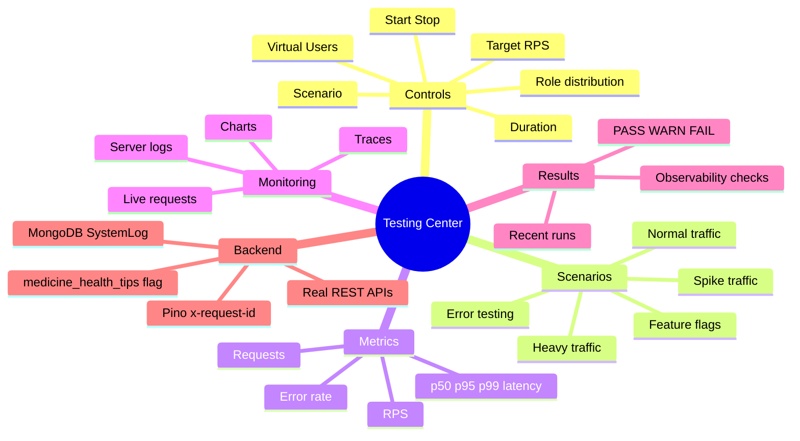
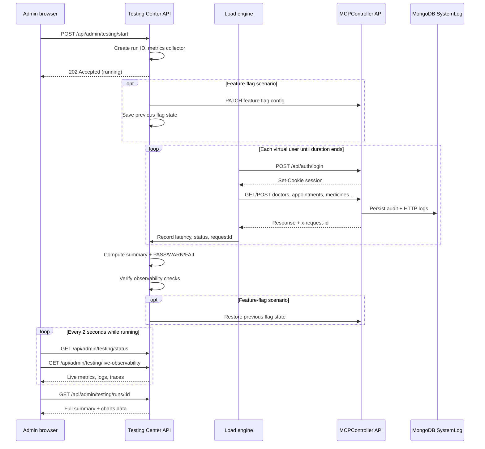
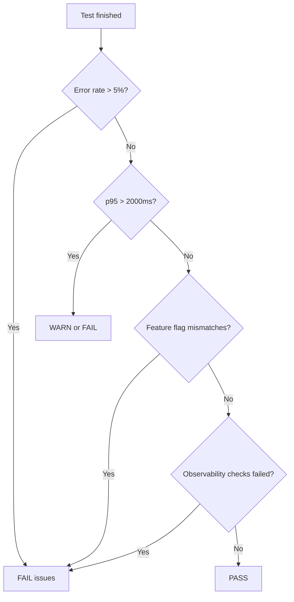

# Testing Center — Complete Guide

The **Testing Center** is an admin-only dashboard at `/admin/testing` that generates realistic fake traffic against your **real MCPController APIs**, then lets you monitor logs, metrics, traces, and feature flags in one place.

This document explains **what it does**, **how it works**, **every control and metric**, and **how to use it** — locally or on Vercel.

For CLI-based load tests (`npm run load:smoke`, etc.), see [LOAD_TESTING.md](./LOAD_TESTING.md).

---

## Table of contents

1. [What problem does it solve?](#what-problem-does-it-solve)
2. [Mind map — everything at a glance](#mind-map--everything-at-a-glance)
3. [Architecture — what talks to what](#architecture--what-talks-to-what)
4. [End-to-end flow when you click Start test](#end-to-end-flow-when-you-click-start-test)
5. [Key concepts (VU, RPS, latency, etc.)](#key-concepts-vu-rps-latency-etc)
6. [Test controls explained](#test-controls-explained)
7. [Scenarios — what each one does](#scenarios--what-each-one-does)
8. [Dashboard panels and tabs](#dashboard-panels-and-tabs)
9. [Feature-flag testing](#feature-flag-testing)
10. [PASS / WARN / FAIL verdict](#pass--warn--fail-verdict)
11. [How traffic is simulated (personas)](#how-traffic-is-simulated-personas)
12. [Observability integration](#observability-integration)
13. [How to run locally](#how-to-run-locally)
14. [How to run on Vercel](#how-to-run-on-vercel)
15. [Safety and limits](#safety-and-limits)
16. [Troubleshooting](#troubleshooting)

---

## What problem does it solve?

Without the Testing Center, you would need to:

- Manually click through the app as admin, doctor, and patient
- Guess whether feature flags work at 10%, 25%, 50% rollout
- Open separate tools to check logs and latency
- Run external load tools (k6, Artillery) and wire them to cookie auth yourself

The Testing Center **automates all of that** inside your existing stack:

```text
Admin starts test → fake users hit real APIs → flags evaluated → logs/metrics/traces stored → dashboard shows results
```

No Prometheus, Grafana, or k6 required — it reuses your **Pino logs**, **MongoDB SystemLog**, and **Observability API** that you already built.

---

## Mind map — everything at a glance

```text
                         TESTING CENTER (/admin/testing)
                                    │
          ┌─────────────────────────┼─────────────────────────┐
          │                         │                         │
     TEST CONTROLS              LIVE DASHBOARD            AFTER TEST
          │                         │                         │
    ┌─────┴─────┐           ┌───────┴───────┐          ┌──────┴──────┐
    │           │           │               │          │             │
 Scenario    Settings    Metric cards    Charts      Summary    Recent runs
    │           │           │               │          │             │
 normal     Virtual       Requests      RPS over    PASS/WARN/   Click to
 heavy      users (VU)    Success/err   time        FAIL         reload
 spike      Duration      RPS           p95 latency  Issues list  full report
 errors     Target RPS    p50/p95/p99
 feature-   Role % mix
 flags      Flag config
    │
    └──► Start / Stop
              │
              ▼
    ┌─────────────────────────────────────────────────────────────┐
    │  Load engine (load-tests/) — cookie auth, HTTP to real APIs   │
    └─────────────────────────────────────────────────────────────┘
              │
    ┌─────────┼─────────┬─────────────┬──────────────┐
    ▼         ▼         ▼             ▼              ▼
 Auth     Doctors   Appointments   Medicines    Feature flags
 login    patients  book/cancel    list/create   /api/auth/me
    │
    ▼
 Observability (same as /admin/observability)
    ├── Live requests tab  (client-side HTTP log)
    ├── Server logs tab    (MongoDB SystemLog + HTTP)
    ├── Traces tab         (grouped by x-request-id)
    └── Feature flags tab  (expected vs actual canView)
```

### Mermaid mind map (for tools that render Mermaid)



---

## Architecture — what talks to what

```text
┌──────────────────────────────────────────────────────────────────────────┐
│  Browser — Admin logged in (JWT cookie)                                   │
│  React page: client/src/pages/TestingCenter.jsx                           │
│    • Polls GET /api/admin/testing/status every 2s (while running)         │
│    • Polls GET /api/admin/testing/live-observability                      │
└───────────────────────────────┬──────────────────────────────────────────┘
                                │ HTTP (same origin)
                                ▼
┌──────────────────────────────────────────────────────────────────────────┐
│  Express — server/services/testCenter.service.js                          │
│    • startRun() → spawns async load in same Node process                  │
│    • stopRun()  → aborts virtual users                                    │
│    • Stores active run + last 20 runs in memory                           │
└───────────────────────────────┬──────────────────────────────────────────┘
                                │ imports
                                ▼
┌──────────────────────────────────────────────────────────────────────────┐
│  Load engine — load-tests/lib/                                            │
│    runner.js      → virtual user loops                                    │
│    personas.js    → admin / doctor / patient assignment                   │
│    scenarios.js   → login, doctors, appointments, medicines, failures     │
│    metrics.js     → RPS, latency percentiles, time series                 │
│    http-client.js → fetch + cookie jar (mcpcontroller_session)            │
└───────────────────────────────┬──────────────────────────────────────────┘
                                │ HTTP to LOAD_TEST_URL / API_URL
                                ▼
┌──────────────────────────────────────────────────────────────────────────┐
│  Your real MCPController API (same server or localhost:3000)              │
│    /api/auth/login  /api/doctors  /api/appointments  /api/medicines  …    │
└───────────────────────────────┬──────────────────────────────────────────┘
                                │ each request
                                ▼
┌──────────────────────────────────────────────────────────────────────────┐
│  Observability pipeline (unchanged)                                       │
│    requestLogMiddleware → Pino → SystemLog (MongoDB)                      │
│    Admin reads via /api/admin/observability/*                           │
└──────────────────────────────────────────────────────────────────────────┘
```

**Important:** The load engine does **not** mock APIs. It performs real HTTP requests with real login cookies, so you see real database writes, real permission checks, and real observability data.

---

## End-to-end flow when you click Start test



### Phases inside one test run

| Phase | What happens |
| --- | --- |
| **1. Starting** | Run ID created; config validated (VU caps, duration caps) |
| **2. Configuring flag** (feature-flag scenario only) | Admin flag temporarily changed; expected config saved |
| **3. Running** | Virtual users login and loop through API workflows |
| **4. Verifying** | Observability checks run; verdict computed |
| **5. Completed / stopped / failed** | Results saved to history; flag restored if needed |

---

## Key concepts (VU, RPS, latency, etc.)

### Virtual Users (VU)

A **virtual user** is one simulated client that:

1. Logs in as admin, doctor, or patient (seeded demo account)
2. Repeats a **workflow** (list doctors → book appointment → list medicines → …) until the test duration ends

| Term | Meaning |
| --- | --- |
| **VU** | Number of parallel simulated users |
| **Why it matters** | More VUs = more concurrent load on MongoDB and Express |
| **Typical local values** | 5–50 for dev; 100+ only if your machine handles it |
| **Max allowed** | 500 (configurable via `TEST_CENTER_MAX_VU`) |

**Analogy:** 20 VUs ≈ 20 people using the app at the same time, each clicking through flows repeatedly.

---

### Duration (seconds)

How long each virtual user keeps working after login (with ramp-up spread at the start).

| Value | Use case |
| --- | --- |
| **30s** | Quick smoke test |
| **60s** | Normal local test |
| **120s+** | Heavy / soak-style run (local only) |

**Max allowed:** 3600 seconds (`TEST_CENTER_MAX_DURATION_SEC`).

---

### RPS (Requests Per Second)

**RPS** = total HTTP requests ÷ elapsed seconds.

| Where you see it | Source |
| --- | --- |
| Metric card **RPS** | Load engine (client-side measurement) |
| **RPS chart** | Buckets of requests every ~5 seconds |

**Higher RPS** means more throughput. It rises when you increase VUs or decrease think time between workflow loops.

---

### Target RPS

Optional throttle. When set above `0`, the engine adjusts pause time between workflow loops to try to stay near your target.

| Setting | Behavior |
| --- | --- |
| **0 (auto)** | As fast as VUs can loop (default) |
| **e.g. 10** | Engine slows loops if observed RPS exceeds target |

Use this to simulate **steady** traffic instead of maximum burst speed.

---

### Latency (ms) — p50, p95, p99

Time from sending an HTTP request until the response arrives (measured by the load engine).

| Metric | Meaning | Why it matters |
| --- | --- | --- |
| **avg** | Mean response time | General feel |
| **p50 (median)** | Half of requests faster than this | Typical user experience |
| **p95** | 95% of requests faster than this | Tail latency — watch for slowdowns |
| **p99** | 99% faster than this | Worst common cases |

**Healthy local targets (defaults):**

- p95 &lt; **2000 ms**
- p99 &lt; **5000 ms**

---

### Error rate

```text
error rate = (failed requests ÷ total requests) × 100
```

| Failed request | Examples |
| --- | --- |
| Unexpected 5xx | Server crash, DB down |
| Unexpected 401 on login | Wrong seed data, rate limit |
| Intentional failures | **Error testing** scenario expects 400/401/403/404 |

In **Error testing** scenario, many "failures" are **expected** and counted as OK by the scenario logic.

---

### Role distribution (%)

Controls what **type** of virtual user each slot simulates:

| Role | Default share | Typical actions |
| --- | --- | --- |
| **Admin** | 10% | Stats, observability API, feature-flag admin |
| **Doctor** | 50% | List patients, appointments, medicines |
| **Patient** | 40% | List doctors, book/cancel appointments, view medicines |

Percentages are normalized to 100%. Example: `10 / 50 / 40` means roughly 1 admin, 5 doctors, 4 patients per 10 VUs.

---

### Ramp-up

Virtual users do **not** all start at once. User `N` waits `(N / rampUpSec) × 1000 ms` before its first request, spreading load gradually and avoiding a single massive spike at second 0.

---

## Test controls explained

| Control | What it does |
| --- | --- |
| **Scenario** | Pre-built test pattern (normal, heavy, spike, errors, feature-flags) |
| **Virtual users** | Parallel simulated clients |
| **Duration** | How long each VU keeps running workflows |
| **Target RPS** | Optional speed limit (0 = full speed) |
| **Role distribution** | Admin / doctor / patient mix |
| **Feature flag config** | (feature-flag scenario) Temporary flag settings |
| **Start test** | `POST /api/admin/testing/start` |
| **Stop test** | Aborts run early; partial results still saved |

---

## Scenarios — what each one does

```text
                    SCENARIO PICKER
                           │
     ┌─────────┬─────────┬───┴───┬─────────┬──────────────┐
     ▼         ▼         ▼       ▼         ▼              ▼
  Normal    Heavy     Spike   Errors   Feature-flags
  traffic   traffic   traffic  testing   testing
```

### 1. Normal traffic

| Setting | Default |
| --- | --- |
| VUs | 20 |
| Duration | 60s |
| Failures | No |

**Purpose:** Everyday mixed load — login, browse doctors, appointments, medicines, feature flag via `/api/auth/me`.

**Use when:** Regular sanity check after code changes.

---

### 2. Heavy traffic

| Setting | Default |
| --- | --- |
| VUs | 100 |
| Duration | 120s |
| Think time | Shorter (faster loops) |

**Purpose:** Sustained higher concurrency to find DB pool or latency issues.

**Use when:** Capacity planning on local/staging.

---

### 3. Spike traffic

Three phases automatically:

```text
  Requests
      │         ████
      │         ████  ← spike (high VUs, short)
      │   ██    ████    ██
      │   ██    ████    ██  ← baseline / recovery
      └──────────────────────► time
```

| Phase | Default |
| --- | --- |
| Baseline | 10 VUs, 20s |
| Spike | 100 VUs, 15s |
| Recovery | 10 VUs, 20s |

**Purpose:** See if the system survives a sudden burst and returns to normal.

---

### 4. Error testing

| Setting | Default |
| --- | --- |
| VUs | 10 |
| Duration | 60s |
| includeFailures | **Yes** |

**Intentionally triggers:**

| Scenario | Expected HTTP status |
| --- | --- |
| Invalid appointment body | 400 |
| Unauthenticated `/api/doctors` | 401 |
| Non-admin `/api/admin/stats` | 403 |
| Missing doctor | 404 |
| Bad login credentials | 401 |

**Purpose:** Verify errors are logged correctly and observability captures them.

---

### 5. Feature-flag testing

| Setting | Default |
| --- | --- |
| VUs | 15 |
| Duration | 90s |
| Flag | 50% doctor rollout, patients enabled |

**Flow:**

1. Saves current `medicine_health_tips` flag
2. Applies your chosen config (10/25/50/100%, specific doctors, patient toggle)
3. Each VU calls `/api/auth/me` and records `canView` / `canManage`
4. Compares **expected** (rollout math) vs **actual** (API response)
5. **Restores** previous flag when done

**Purpose:** Prove percentage rollouts are stable and correct per user.

---

## Dashboard panels and tabs

### Top metric cards

| Card | Description |
| --- | --- |
| **Requests** | Total HTTP calls in selected run |
| **Success / Errors** | Counts + error rate % |
| **RPS** | Average requests per second |
| **Latency p95** | 95th percentile; hint shows p50 and p99 |

### Charts

| Chart | Shows |
| --- | --- |
| **Requests per second** | Traffic intensity over time (5s buckets) |
| **p95 latency** | Slowdowns over time |

Hover bars for exact values. **Latest / Avg / Max** shown in chart header.

---

### Tab: Live requests

Client-side log from the load engine — every HTTP call with:

- Time, role, method, path, scenario name
- HTTP status, duration (ms)
- **Trace** link → opens trace detail for that `x-request-id`

Best for: debugging **which API** was slow or failed during the test.

---

### Tab: Server logs

Reads from your **real observability stack** (MongoDB `SystemLog`), filtered from the **run start time**.

Includes:

- **Audit logs** — Login, Book Appointment, etc.
- **Technical HTTP logs** — `http.request.completed` (when includeTechnical is on)

**Click any row** → modal with full detail: user, role, route, duration, errors, metadata.

Best for: confirming **server-side logging** works under load.

---

### Tab: Traces

Groups logs by **`x-request-id`** into end-to-end timelines.

**Click a trace row** → highlighted selection + **Selected trace** panel below with:

- Each step (operation, time, duration, status)
- Error messages if any
- Link to open individual log entries

Best for: following **one request** through the system.

---

### Tab: Feature flags

Shown when feature-flag data exists (especially in feature-flag scenario).

| Column | Meaning |
| --- | --- |
| **Expected** | What rollout logic says `canView` should be |
| **Actual** | What `/api/auth/me` returned |
| **Match** | ✓ or ✗ |

Also shows **match rate** % across all samples.

---

### Tab: Summary

| Section | Content |
| --- | --- |
| **Verdict badge** | PASS / WARN / FAIL |
| **Issues list** | Why WARN/FAIL (high error rate, flag mismatches, etc.) |
| **Load summary** | Requests, RPS, p95 |
| **Observability checks** | Automated verification pass count |
| **Recent runs** | Click any run to reload its full report |

When a test finishes, the latest run is **auto-selected** here.

---

## Feature-flag testing

### Flag: `medicine_health_tips`

Controls **Medicine & Health Tips** for doctors and patients.

| Mode | Behavior |
| --- | --- |
| **100% (all doctors)** | `doctorAccess: all` |
| **Percentage** | Stable hash bucket per doctor — same doctor always gets same result |
| **Specific doctors** | Only listed doctor IDs included |
| **Patients enabled** | Patients see medicines when on |

### Expected vs actual

```text
  For each virtual user:
       │
       ├─► Login as doctor/patient/admin
       │
       ├─► GET /api/auth/me
       │        └── user.features.medicine_health_tips.canView
       │
       └─► Compare to rollout.js expected bucket
                │
                ├── Match  → ✓
                └── Mismatch → ✗ (FAIL if any in verdict)
```

Percentage buckets use `server/lib/rollout.js` — the same code as production, not a separate test mock.

---

## PASS / WARN / FAIL verdict

After each run, the Testing Center computes a verdict:



| Status | Meaning |
| --- | --- |
| **PASS** | Within latency/error thresholds; flags match; observability OK |
| **WARN** | Minor threshold breach but no critical failures |
| **FAIL** | High errors, flag mismatches, or observability verification failed |

Default thresholds (in `load-tests/config.js`):

- Error rate max: **5%**
- p95 max: **2000 ms**
- p99 max: **5000 ms**

---

## How traffic is simulated (personas)

The engine uses **seeded demo accounts only** — never random production users.

| Role | Email | Password |
| --- | --- | --- |
| Admin | `ADMIN_EMAIL` from `.env` | `ADMIN_PASSWORD` |
| Doctor | `ahmed@clinic.example`, `ali@clinic.example`, `sarah@clinic.example` | `Doctor123!` |
| Patient | `patient.a@example.com`, `patient.b@example.com` | `Patient123!` |

Run `npm run seed` once to create these accounts.

### Typical workflow loop (per virtual user)

```text
  login
    → GET /api/health
    → GET /api/auth/me
    → GET /api/doctors
    → GET /api/doctors/:id
    → [patient] POST book appointment → POST cancel
    → [doctor/admin] GET /api/patients
    → GET /api/appointments
    → GET /api/medicines
    → GET /api/auth/me (feature flag check)
    → [admin] stats, observability, feature-flag APIs
    → [errors scenario] trigger 400/401/403/404
    → pause (think time or RPS throttle)
    → repeat until duration ends
```

---

## Observability integration

The Testing Center does **not** replace [Observability](/admin/observability). It **feeds** it:

| Testing Center shows | Same data as Observability |
| --- | --- |
| Server logs tab | `/api/admin/observability/logs` |
| Traces tab | `/api/admin/observability/traces` |
| HTTP / audit counts | `/api/admin/observability/metrics` |

Every API response includes **`x-request-id`**. All logs for one request share that ID — use it to connect **Live requests** → **Traces** → **Logs**.

For deep investigation after a test, open **Observability** with a wider time window.

---

## How to run locally

### Terminal 1 — API server

```powershell
npm run server
```

Auth rate limits are relaxed automatically while a Testing Center test is running — you do not need `LOAD_TEST=true`.

Optional: `$env:LOG_LEVEL="info"` for more verbose server logs during tests.

### Terminal 2 — seed + frontend

```powershell
npm run seed    # first time only
npm run dev
```

### Browser

1. Open `http://localhost:5173`
2. Log in as **admin**
3. Navbar → **Testing Center**
4. Configure → **Start test**

**Do not** set `NODE_ENV=test` on the server — that stops logs from persisting to MongoDB.

---

## How to run on Vercel

1. Deploy as usual with your normal env vars (`MONGODB_URI`, `ADMIN_EMAIL`, `ADMIN_PASSWORD`, `APP_URL`, `API_URL`, etc.).
2. Seed Atlas once from your machine: `npm run seed`
3. Log in as **admin** → open **Testing Center** (`/admin/testing`) → start a test.

**No `ENABLE_TEST_CENTER` or `LOAD_TEST` needed.** The UI detects Vercel and caps tests at 20 VUs / 45 seconds automatically.

For heavier load against production, use the CLI from your laptop:

```powershell
$env:LOAD_TEST_URL="https://your-app.vercel.app"
npm run load:smoke
```

---

## Safety and limits

| Rule | Reason |
| --- | --- |
| **Admin-only** | All `/api/admin/testing/*` routes require admin role — this is the security gate |
| **No extra env vars** | Works on Vercel/local without `ENABLE_TEST_CENTER` or `LOAD_TEST` |
| **Auto rate-limit bypass** | Login rate limits are skipped only while a Testing Center run is active |
| **Seeded accounts only** | Virtual users use demo doctor/patient/admin seed accounts |
| **Vercel auto caps** | On Vercel (`VERCEL` detected): max **20 VUs**, **45s** duration (serverless 60s limit) |
| **Local caps** | Up to **500 VUs**, **3600s** duration (override with `TEST_CENTER_MAX_VU` / `TEST_CENTER_MAX_DURATION_SEC` if needed) |
| **Feature flag restored** | After feature-flag scenario, previous flag settings are put back |

Appointment booking during tests creates **real test data** in MongoDB (bookings may be cancelled in the same loop, but some records can remain).

---

## Troubleshooting

| Problem | Fix |
| --- | --- |
| Empty server logs tab | Ensure server is not in `NODE_ENV=test`; run with `LOG_LEVEL=info` |
| Login failures in live requests | Run `npm run seed`; confirm demo account passwords |
| Flat / empty charts | Wait until a few requests complete; charts need active or selected run |
| Recent run click shows nothing | Refresh page; ensure server was not restarted (in-memory history clears) |
| Feature-flag mismatches | Check rollout percentage vs small doctor count; see [LOAD_TESTING.md](./LOAD_TESTING.md) |
| 429 on login during test | Should not happen while a run is active; retry after run completes |

---

## Related files

| Path | Purpose |
| --- | --- |
| `client/src/pages/TestingCenter.jsx` | Admin dashboard UI |
| `server/services/testCenter.service.js` | Run orchestration, history, verdict |
| `server/controllers/testCenter.controller.js` | REST endpoints |
| `load-tests/lib/runner.js` | Virtual user engine |
| `load-tests/lib/scenarios.js` | API workflows |
| `load-tests/lib/metrics.js` | RPS, latency, charts data |
| [LOAD_TESTING.md](./LOAD_TESTING.md) | CLI load tests |
| [OBSERVABILITY.md](./OBSERVABILITY.md) | Logs, traces, request IDs |

---

## Quick reference card

```text
┌─────────────────────────────────────────────────────────────┐
│  LOCAL QUICK START                                          │
│  1. npm run server && npm run dev                           │
│  2. npm run seed (once)                                     │
│  3. Admin → Testing Center → Start test                     │
├─────────────────────────────────────────────────────────────┤
│  KEY METRICS                                                │
│  VU = parallel users │ RPS = req/sec │ p95 = tail latency   │
├─────────────────────────────────────────────────────────────┤
│  SCENARIOS                                                  │
│  Normal │ Heavy │ Spike │ Errors │ Feature flags            │
├─────────────────────────────────────────────────────────────┤
│  TABS                                                       │
│  Live requests │ Server logs │ Traces │ Flags │ Summary     │
└─────────────────────────────────────────────────────────────┘
```
